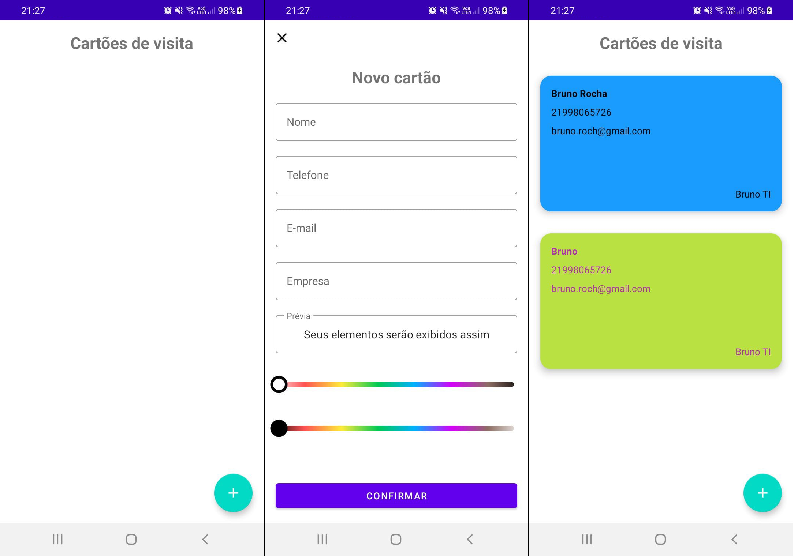

# Kotlin Practice Business Card

- Instrutor: Igor Rotondo Bagliotti
- Repositório Original: https://github.com/igorbag/Business-Card.git
- Plataforma de Ensino: https://digitalinnovation.one/sign-up?ref=K5EF2VCVKA
- Módulo Criando um App de Cartão de Visitas em Kotlin - Dio Bootcamp Inter Dev Android

## Vídeo Explicativo

[Youtube](https://youtu.be/yCFYWJOt82s)

##  Objetivo

- Aplicação destinada à prática do módulo Criando um App de Cartão de Visitas em Kotlin do Bootcamp Inter Dev Android. Aplicativo para o usuário criar, listar, e compartilhar seus Cartões de Visita. Foi utilizado o projeto do repositório original do módulo como base, e adicionadas funcionalidades para o usuário selecionar a cor, numa ColorSeekBar (Barra de Cores), tanto para o fundo do cartão de visitas como para o texto, com exibição de uma prévia da combinação das cores escolhidas. Esta nova funcionalidade também impede que o usuário informe valores inválidos na escolha das cores. Para persistir os dados foi utilizado banco de dados Room.

## Tecnologias Utilizadas

- Kotlin
- TypeScript
- Room
- MVVM
- ViewBinding
- LiveData
- ListAdapter
- Material Design
- ColorSeekBar
- Definir atributos personalizados no laytout (declare-styleable / format="reference")

## Conteúdo apresentado

- Preparação do ambiente e criação do nosso App
- Montando layout do projeto
- Configuração do room database
- Compartilhamento de cartão de visita

## Desafio proposto

- Implementar uma melhor experiência de como o usuário pode escolher a cor do fundo do Cartão de Visitas, como também impedir que sejam informados valores inválidos.

## Autor

- Bruno Gamba Rocha
- https://www.linkedin.com/in/bruno-gamba-rocha/
